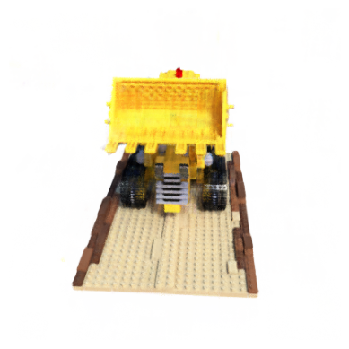
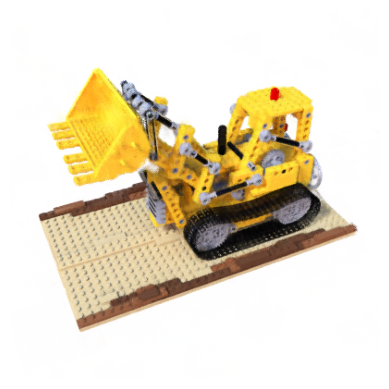
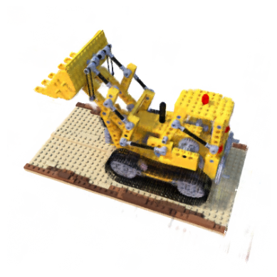
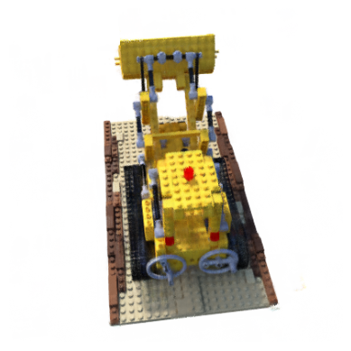

# KiloNeRF
Speeding up Neural Radiance Fields with Thousands of Tiny MLPs

Check out the paper on <a href="https://arxiv.org/abs/2103.13744">arXiv</a>
<table>
<tr>
<td></td>
<td></td>
<td></td>
<td></td>
</tr>
</table>

## Requirements
Install from <a href="requirements.txt">requirements.txt</a>

## Datasets
Download <a href="https://drive.google.com/drive/folders/18bwm-RiHETRCS5yD9G00seFIcrJHIvD-?usp=sharing">Datasets</a>

## Config
You must change the path in <a href="config.py">config.py</a>

## Run
```
python script.py
```

## Models
We have been trained some models with different parameters

You can download model from <a href="https://drive.google.com/drive/folders/1mWr62Sz5m3nF44kJXf-gX9X4NKJYMcjG?usp=share_link">here</a>
